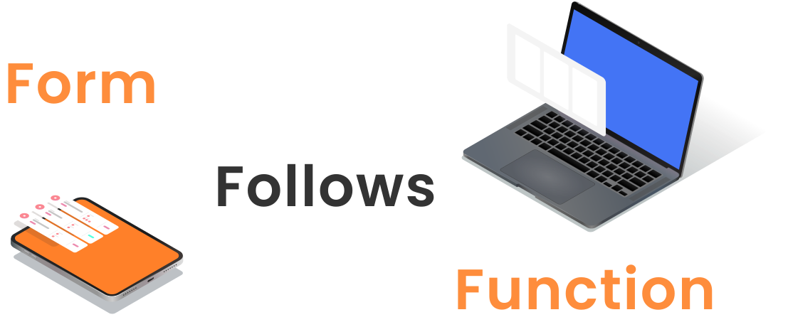

<link rel="stylesheet/less" type="text/css" href="styles.less" />

    
    
        
    

    

        

            ACM Design is the premier club on campus for learning graphic design and user experience. Lorem ipsum something something ACM Design started as something origin story is probably like a line or two.     
        

        

            Things we do include projects and stuff such as this website and the styleguide haha find it in projects or something something ok bye wee        
        

    

    <h1 class="center">Who we are </h1>
    

        <h1>Board</h1>
        
        

            
            
{{person.name}}

            
{{person.role}}

        

        
    

    

        <h1>Designers</h1>
        
        

            
            
{{person.name}}

            
{{person.role}}

        

        
    

    

        <h1>Developers</h1>
        
        

            
            
{{person.name}}

            
{{person.role}}

        

        
    

    

        <h1>Emeritus</h1>
        
        

            
            
{{person.name}}

            
{{person.role}}

        

        
    

